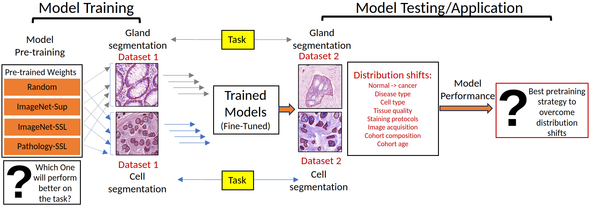

# Histopathology-Domain-Specific-Pretraining
This Repository is Linked to Code and Results for the paper published in "MILLanD 2023: the 2nd Workshop on Medical Image Learning with noisy and Limited Data" in MICCAI 2023".

# Paper

- [Archive Version](https://arxiv.org/pdf/2307.03275.pdf)
- [MILLanD Wrokshop](https://arxiv.org/pdf/2307.03275.pdf) TO BE UPDATED

## Recommended Citation

# Study Design


Figure-1 : **Do different weight initialization matter?** The study is designed from the perspective of an AI user who can choose between multiple pretrained models (domain or non-domain, supervised or self-supervised) options for a given task. The best pretrained model is the one that has the highest accuracy on the task and is least affected by distribution shifts. This study provides a framework to choose amongst pretrained models and select the most advantageous for the task.

```
Note :- This repository is still under construction. 
Please wait until this note has been removed before using the associated code.

```

# How to use 

## Command Line


